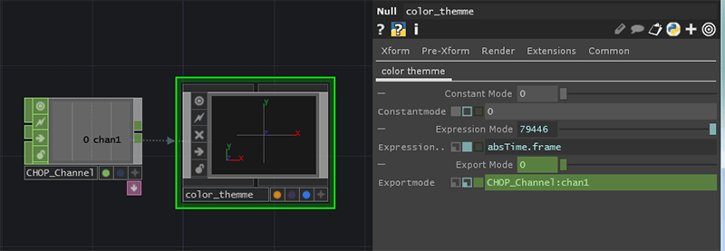
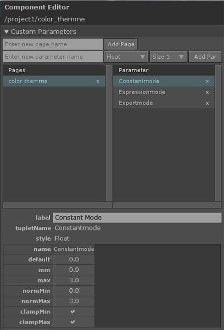

# 参数

参数就是让每一个节点能够以我们认为真确的计算方式来处理数据的依据。如何真确的调整参数值就是运用好节点的关键。参数的类型可以分为整数/浮点/字符串/节点类/几何文件等等，但是从表达形式上来说其只分为三种模式：
<插入导出的激活图标>

1. Constant Mode - 常数模式
2. Expression Mode - 表达式模式
3. Export Mode - 导出模式

常数模式是参数表达的默认形式，直观看起来它就是灰色的。我们可以直接使用鼠标左键点击需要修改的参数进行调整。表达式模式是通过使用Python/Tscript脚本或者直接加减乘除类的数学表达式来描述某一个参数是通过什么计算或者引用得到的。颜色显示上会是暗灰色或者亮蓝色。这里提到的Python和Tscript细节会在后文中详细介绍。导出模式是某参数数值参考另外一个CHOP节点的某一通道(Channel)，且只能从CHOP节点中导出通道值。这种模式下，参数值一般会是亮绿色。具体显示如下：

如图所示，作者添加了一个名为`color_themme`的`Null`组件节点并在组件中添加了名为`color themme`的新参数页面，在该新页面中定义了分别名为`Constant Mode/Expression Mode/Export Mode`的参数。另外添加了一个名为`CHOP_Channel`的`Constant`CHOP节点，并将该节点的`chan1`数值导出给了`color_themme`节点的`Export Mode`参数。这里有几个值得注意的地方：
1. 每个参数名右手边紧跟着的三个小图标分别所激活的都不一样，且颜色也不一样。`Constant Mode`激活的是第一个图标，`Expression Mode`激活的是第二个图标，`Export Mode`则激活的是第三个图标。这种显示方式能够非常直观的告诉使用者每个参数的当前状态，便于使用者做出准确的判断。
2. 用户可以直接在参数中输入脚本或者表达式，TouchDesigner或自动识别为表达式内容，并将参数跳转为亮蓝色，但是默认指挥显示表达式做计算的到的数值，不管静态还是动态的。通过点击每个参数的标签名，可以显示该参数的第二行完整信息。如上面的`Expression Mode`参数，作者所写的`absTime.frame`就是一个非常简单的Python语句。通过展开完整信息，使用者便可随意修改内容了。
3. 将CHOP节点的某一通道作为参数的导出数值，最快捷大方法是首先选择对应的CHOP节点，按下键盘`A`键进入该节点可编辑模式，同时确保将要被导入的参数的窗口是显示状态，用鼠标左键选择CHOP节点的对应通道名字，按下保持住并拖拽到木匾参数数值上，松开鼠标会在鼠标光标附件显示一个小目录，选择`Export Chop`，这样就完成了导出模式。
4. 作者在上述使用的自定义参数是比较高级的一种自定义控制面板的方法，在后期规整一些关键参数的时候可以使用该方法，但是前期使用的价值不太大。需要提醒的是不是所有的节点有自定义参数的能力，目前只有组件节点能够进行该操作。具体实现方法是鼠标右击对应的组件节点，选择`customize...`,你将会看见如下如：

在`Enter new page name`中输入需要新增的参数页面名字，如`color_themme`中的`color themme`页面。在`Enter new paremeter name`中输入需要在上述参数页面中新增的参数名字。每一个参数都会有自己的标签名(label)也原参数名(tupletName)，标签名是在参数窗口中显示出来的名字，而原参数名是用于在表达式或者标本文件中用于调用该参数的名字。在新增参数的同时需要选择该参数的类型，点击有`Float`默认名字的下拉列表将会显示出所有能够选择的参数类型。在新增好一个参数后，面板下部分会有该参数值得一些基本设定。
```
name              - 参数名
default           - 定义参数默认值
min/max           - 定义参数的绝对最小和最大值
normMin/normMax   - 定义参数面板中滑动条的最小值和最大值
clampMin/clampMax - 如果小于范围最小值将自动变为所设定的最小值，如果大于范围最大值将自动变为所设定的最大值。
```