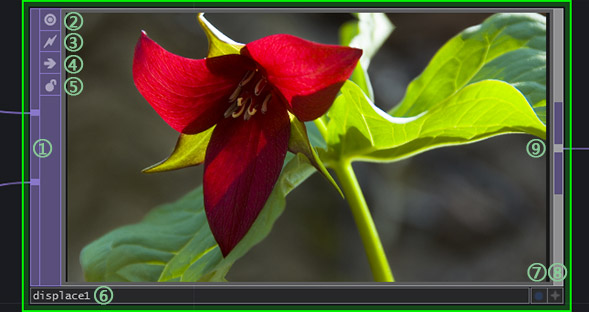

# 节点

读者可以通过点击键盘`Tap`键来显示所有能够创建的节点。

其中系统更具节点各自输入输出的数据类型的不同分成了五大类，而且所有的节点也根据类的不同会有的颜色，具体每个类都有哪些作用会在第三章中详细讨论，在此不做赘述。
```
> COMP - 组件类
> TOP  - 图片类
> CHOP - 通道类
> SOP  - 几何体类
> MAT  - 材质类
> DAT  - 文本数据类
```

整体上来说节点能划分成两大类，一种是产生数据，另一种为过滤（处理）数据。前者一般是一个节点流的起始端点，而之后的所有节点不论是串联还是合并都是对数据的处理过程。

我们拿在打开软件之后看就直接能看到的节点`Displace节点`来说：


1. 输入端。该节点有两个输入端，正如上面对节点的划分来说，节点如果在起始端能够产生数据的话那就没有输入端，而处理数据的节点根据自身的性质不同有一个到三个输入端。如果超过三个输入口，界面显示上将会是一个比较宽的输入端。
2. 切换节点显示画面还是节点对应的类的缩略字。一般来说后者对系统负担最小，所以在项目随着节点数变多之后，最好把稳定的节点模块同一都只提示类别提示就可以了。因为直接显示处理数据的可是画面虽然非常直接，但是这样的话该节点就会要消耗实际显示效果的计算资源。
3. 克隆免疫。这个在谈及克隆这个话题的时候在提及。
4. 忽略该节点。可以让整个节点数据流中忽略该节点的功能，也就是说该节点不参与计算，由第一个输入数据端直接通过输出端传给下游。
5. 锁定。激活该按钮后，该节点的参数不能做任何修改，除非解锁。
6. 节点名字。可以单击后更换，需要注意的是TouchDesigner中的命名方式是首字母如果是符号则只能是`_`，允许数字为第一个字符，中间不允许出现空格。
7. 预览显示。激活后，整个节点网络背景会为该节点的计算画面。当然该显示功能只针对`TOP`/`CHOP`节点类有，而每个节点类都有其各自自己特有显示属性，读者可以尝试。
8. 激活交互式编辑窗口。该按钮激活之后能够直接在该节点上对内容作多角度预览或者直接文本编辑，也是不同的节点类对应不同的交互类型。
9. 输出端。除了部分组件节点其他的节点都有且只有一个输出端。其实这也是非常好理解的，不论一个函数还是功能的输入端有多少，最终计算完都只有一个唯一解，这样一是能极大地减少节点连线的复杂度，另外也是功能模块细分到最小化的一个表现。