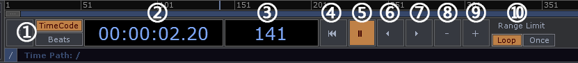

# 时间信息与播放控制
时间信息与播放控制面板在界面的下方，在讲解面板内容之前先介绍一下时间的单位`帧`。

帧是画面由静态图变为运动画面在时间累积上的最小单位。帧速率则是每秒钟播放的帧数。正常的电影使用的是24帧每秒，NTSC（北美、日韩地区电视制式）的帧速率为29.97，PAL（中国、欧洲地区电视制式）的帧速率。我们优势看到的慢镜头则是由高速摄影（每秒拍摄的帧数高于正常播放帧速率）拍摄的画面用正常帧速率进行播放的效果。

TouchDesigner的播放最小单位也是以帧为单位。下面则是其控制播放的主面板样子：


```
1. TimeCode/Beats， 切换时间码数字是由时:分:秒:帧的形式显示还是有节奏的形式显示。
2.  显示当前播放时间。
3.  显示当前播放的总帧数。
4. 重置当前帧到第一帧。
5. 暂停时间线。
6. 反向播放。
7. 正向播放。
8. 向后跳一帧。
9. 向前条一帧。
10. Loop/Once，切换是循环播放时间码还是只允许播放一次。
```
在上述的这些操作按钮之外，读者还可以使用鼠标左键拖拽在时间线上移动的指针来定位到自己希望播放的指定帧数。但是这种跳跃式的步进不会影响视频播放节点使之产生同样的跳跃，默认只会识别为当前帧与下一帧的跳跃。

在时间控制面板左边则是时间基本信息面板。正常来说用户直接使用这些默认值就可以。

用户可能用的最多的两个参数将会是`FPS`和`Tempo`，第一个是定义每秒钟在TouchDesigner中播放的帧数，同时也是渲染画面的速率。如果画面的渲染复杂度比较高或者应用比较臃肿的情况下，播放速度达不到在这预设的帧速率，这种情况下界面顶端的FPS数会显示真实的帧速率。如果计算能力能超过这个预设帧速率，TouchDesigner会在渲染画面之前有个等待过程，确保帧速率不会超过预设值。第二个是确定节拍速率。分别是和之前提到的`TimeCode`以及`Beats`配合使用。
`Start`和`End`确定了时间线面板中的开始帧和结束帧。`RStart`是相对开始时间，`REnd`则是相对结束时间，相对帧数只会在绝对帧数之内。在需要循环播放某一个设计的动画的时候，是可以使用相对帧的设置来完成，但正常项目中，时间线是控制的整体时间进度，用设置相对帧的方法播放循环有可能会弄巧成拙，一般循环都会在参数中或者脚本中控制好。这个在后文中会有类似案例。