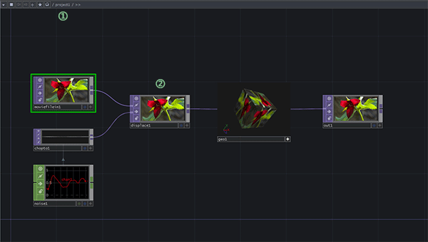
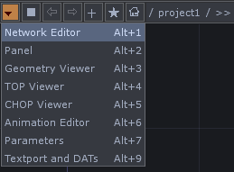

# 节点网络编辑窗口

在打开TouchDesigner之后，在视野中占最大面积的部分就是节点网络编辑窗口，之后的所有节点之间的组合与连接都是在这个窗口中完成与预览。

* ①显示的是当前窗口在编辑的项目中哪个对应的路径下（项目的概念稍后会提到）
* ②显示的是该编辑窗口中调取到的节点细节。


准确来讲这个主窗口能够显示的内容如图几个大的方面：



其中作者所说的节点网络编辑窗口就是图中所显示的第一个`Networrk Editor`。另外的几个也比较重要，这里只做简单的翻译不做太详细的讲解，在之后的内容中所有相关面板都会慢慢被提及。所以在这请稍安勿躁，读者只需要知道这个面板最大的作用就是用来组织与显示我们编辑的节点。
```
Panel - 面板
Geometry Viewer - 几何体预览器
TOP Viewer - TOP节点预览器
CHOP Viewer - CHOP节点预览器
Animation Editor - 动画编辑器
Parameters - 参数面板
Textport and DATs - 命令行窗口与数据显示
```